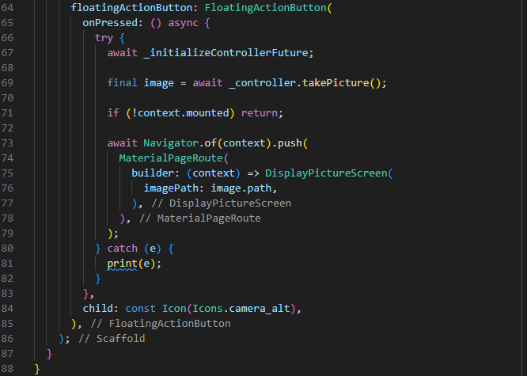

Jobsheet 9

Nama : Febby Mathelda Silvya Mooy

Kleas: TI-3A

NIM: 2241720067

Tugas Praktikum:

1. Selesaikan Praktikum 1 dan 2, lalu dokumentasikan dan push ke repository Anda berupa screenshot setiap hasil pekerjaan beserta penjelasannya di file README.md! Jika terdapat error atau kode yang tidak dapat berjalan, silakan Anda perbaiki sesuai tujuan aplikasi dibuat!

Jawab:

Praktikum 1

Langkah 1: 

Buatlah sebuah project flutter baru dengan nama kamera_flutter, lalu sesuaikan style laporan praktikum yang anda buat

Jawab:

Langkah 2: Tambah dependensi yang diperlukan

Langkah 3: Ambil sensor kamera dari device

Langkah 4: Buat dan inisialisasi kameracontroller

Langkah 5 : Gunakan CameraPreview untuk menampilkan preview foto

Langkah 6 : Ambil foto dengan CameraController

Langkah 7 : Buat Widget baru DisplayPictureScreen

Langkah 8: Edit main.dart

Langkah 9: Menampilkan hasil foto

Hasil:

sebelum mengambil gambar 

setelah mengambil gambar

